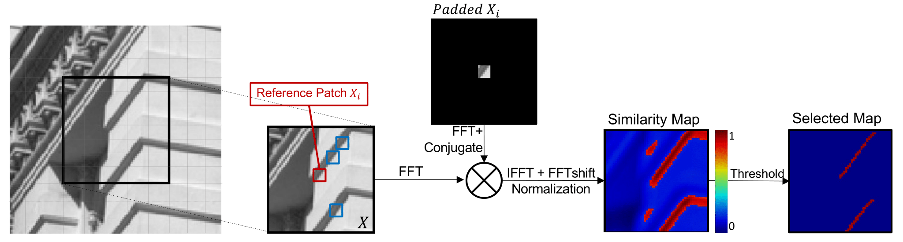

# Self-Convolution

Description
-----

Self-Convolution is a self-supervised image non-local smilarity exploiting operator, which can generalize many commonly used non-local schemes, including block matching and non-local means. This repo mainly focus on the scenario where it equates to block matching.



The package includes 2D patch and 3D patch versions of Self-Convolution (2D or 3D here means the size of image patch). We choose the famous gray-scale image denoising method [SAIST](http://see.xidian.edu.cn/faculty/wsdong/Papers/Journal/TIP_LASSC.pdf) as example of 2D patch and our proposed multi-modality image denoising method [Self-MM](https://arxiv.org/abs/2006.13714) as example of 3D patch. The Self-Convolution function can be plugged in any block matching based image restoration method, just follow the similar usage steps.

Usage
-----
* 2D Patch

example method: [SAIST](http://see.xidian.edu.cn/faculty/wsdong/Papers/Journal/TIP_LASSC.pdf)

usage: 1. replace `Block_matching.m` function with our `self_convolution_2d.m` function (2d here means the size of search window)
2. run `Denoising_Main.m` (a gray-scale image denoising demo)

* 3D Patch

example method: Self-MM

usage: run `demo_rgbnir_denoising.m` (a RGB-NIR image denoising demo)

Experimental Results
-----
Runtime (in seconds) comparisons of non-local algorithms using BM and Self-Convolution, for denoising 512 $\times$ 512 single-channel images and 256 $\times$ 256 $\times$ q multi-channel images, where BMtime\% denotes the runtime portion of BM.

|  Method   | Original Runtime | Self-Conv Runtime | BMtime\% |Original BM | Self-Conv | Speed-Ups|
|  ----  | ----  | ----  | ----  | ----  | ----  | ----  |
| [SAIST](http://see.xidian.edu.cn/faculty/wsdong/Papers/Journal/TIP_LASSC.pdf) | 708.2 | 562.2 | 32.0\% |227.0 |78.6 |3$\times$ |
| WNNM | 63.2 | 43.8 | 36.9\% | 23.3 |7.8| 3$\times$ |
| STROOLR | 87.7 | 68.9 | 36.7\% | 38.2 | 13.3 | 3$\times$ |
| GHP |  412.6 | 218.3 |69.9\% |288.6 |94.2 |3$\times$|
| NCSR |  134.7 | 82.4 | 57.1\% | 76.9 | 28.1 | 3$\times$ |
| PGPD |  305.2 | 89.6 | 85.3\%| 260.3  | 41.3 | 6$\times$|
| RRC  | 601.2 | 505.6 | 26.9\%| 161.8  | 74.2 | 2$\times$ |
| MCWNNM | 2899.0 | 2371.3 | 15.8\%| 458.6  | 61.6 | 8$\times$ |
|SALT | 375.9 |113.8 |75.4\% |294.8  |33.2 |9$\times$|
| [Self-MM](https://arxiv.org/abs/2006.13714) |139.0| 44.3 |78.8\% |109.5 |16.3 |7$\times$|

All the experiments are carried out in the Matlab (R2019b) environmentrunning on a PC with Intel(R) Core(TM) i9-10920K CPU 3.50GHz.

Citation
-----
Paper available [here](https://arxiv.org/abs/2006.13714). 

In case of use, please cite our publication:

Guo L, Ravishankar S, Wen B. Self-Convolution: A Highly-Efficient Operator for Non-Local Image Restoration[J]. arXiv preprint arXiv:2006.13714, 2020.

Bibtex:
```
@article{guo2020self,
  title={Self-Convolution: A Highly-Efficient Operator for Non-Local Image Restoration},
  author={Guo, Lanqing and Ravishankar, Saiprasad and Wen, Bihan},
  journal={arXiv preprint arXiv:2006.13714},
  year={2020}
}
```
